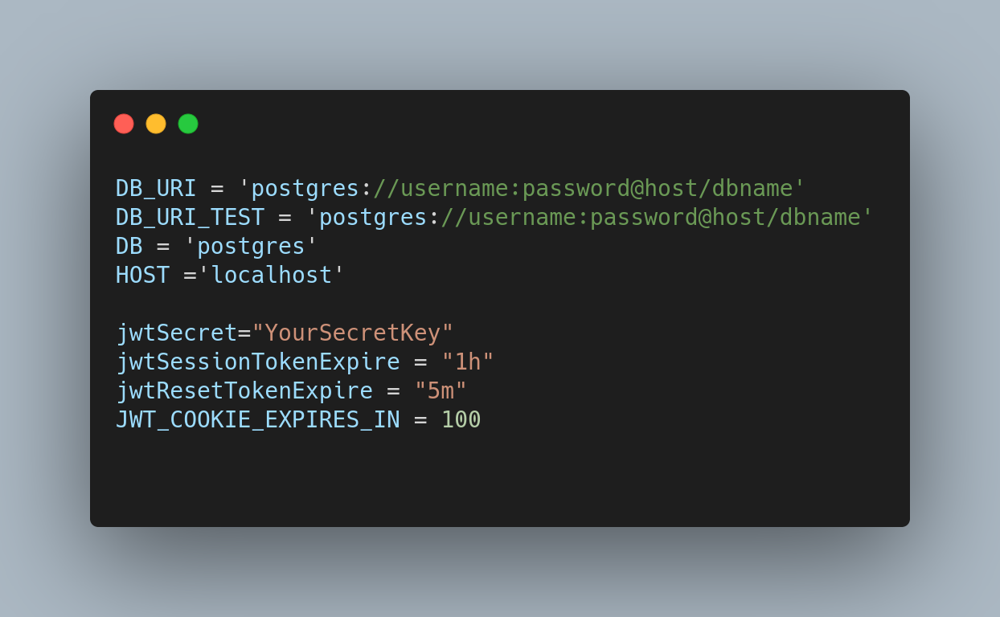

# StoryHub backend

# About 
This repository serves as a backend for my StoryHub applcation which is a fullstack internship learning project at CEFALO. You can visit the frontend part [here](https://github.com/RakibulRanak/story-client).

# Getting Started

To get the Node server running locally:

- Clone this repo
- `npm install` to install all required dependencies
-  create an .env file in the root folder containing following variables :

    # 
- `npm start` to start the local server
- `npm test` to run the test files

Alternately, you can quickly test the api server with postman on cloud (https://storyhubbackend.herokuapp.com/) or to visit the web app you can visit https://story-hub-application.herokuapp.com/

# Description
StoryHub is mainly a simple blogging web app, where a random person can become an user by signing up with email, username, name and password. A user can post story with a valid title, and content. Users can also edit or delete their respective stories while logged in.

# Tools and Technologies

I have used a remote PostgreSQL database service (https://www.elephantsql.com/ ) 

- [expressjs](https://www.npmjs.com/package/express) - The server for handling and routing HTTP requests
- [jsonwebtoken](https://www.npmjs.com/package/jsonwebtoken) - For generating JWTs used by authentication
- [pg](https://www.npmjs.com/package/pg) - As a PostgreSQL client for Node.js
- [sequelize](https://www.npmjs.com/package/sequelize) - As a promise-based Node.js ORM tool for PostgreSQL
- [cors](https://www.npmjs.com/package/cors) - For enabling CORS with various options.
- [jest](https://www.npmjs.com/package/jest) - As a testing framework.

and others.

# Api Documentation

- [User Related](/documentation/userApiDoc.md) 
- [Story Related](/documentation/storyApiDoc.md) 

# Dockerization & Deployment

- Instructions I Followed For :

    - [Dockerization](/documentation/docker.md) 
    - [Deployment](/documentation/deploy.md) 

